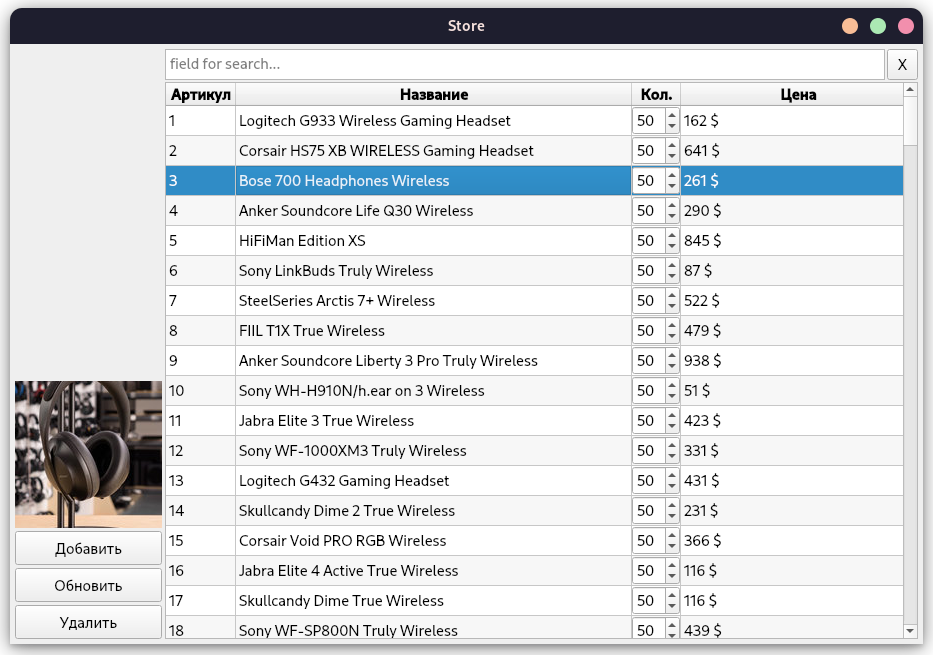

# SHOP-storage_course-work


## Usage of MakeFile

``` 
Required section:
 develop - create environment,  database and prepare configs 
 build - build project into build directory, with configuration file and environment
 clean - clean all addition file, build directory and output archive file
 test - run all tests
 pack - make output archive
 app  - run our app
```

### Build dev environment
```shell 
make develop
```

### Run app
```shell  
make clean
make develop
make build
make app
```

## Preview



## Available actions

- Search by name
- Update Headphones info
- Add new Headphones
- Update tables to fit new db values
- Fill up __SQLite3__ db using [this class](./store/db/sqlite_wrapper.py)
- Parse HTML site to grab all headphones info

## Get DB data
[SQLite3 File](./store/data/sqlite_table.db)

Work with db you can simple just by using [SqliteWrapper class](./store/db/sqlite_wrapper.py) 

- Add
- Update
- Get All
- Get by one Attribute
- Remove by any of attributes
- One instance of class in all app


Edit this file to get data: [File](./store/db/get_db_data.py)
``` 
python store/get_db_data.py
# Ouput for now:
# Total amount of headphones: 195
```
There is simple `namedTuple` __Headphones__ for handle all information about our headphones

### DB columns

 - link to image
 - name of the Headphone
 - Product year
 - Neutral sound
 - Commute
 - Sports
 - For office
 - Wireless Gaming
 - Wired Gaming
 - Phone Calls
 - Color
 - Random price